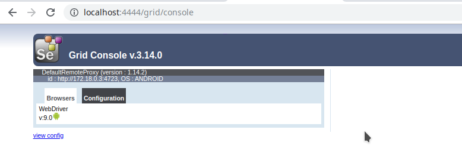
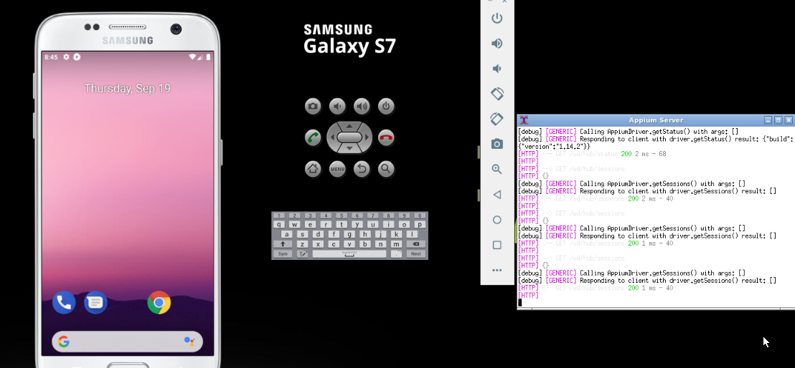

## System Requirements: 
+ JDK: https://docs.oracle.com/en/java/javase/index.html 
+ Maven: https://maven.apache.org/download.cgi 
+ Git client: https://www.atlassian.com/git/tutorials/install-git 
+ Docker 18.09+: https://docs.docker.com/install/linux/docker-ce/ubuntu/    
+ Docker compose 1.24+: https://docs.docker.com/compose/install/  

# Running with Docker

# Getting started
 [Download]: <https://github.com/Crowdar/Lippia-mobile-sample-project/archive/master.zip>
- [Download] and unzip the source repository for this guide or clone it using Git:  
    ```
    $ git clone https://github.com/Crowdar/Lippia-mobile-sample-project.git
    ```
- Go to root directory  
    ``` 
    $ cd lippia-mobile-sample-project 
    ```

#### Stack
This solution use docker containers to generate a context to execute the tests. 
Through docker compose we configure the following  
  
-	Selenium hub  
-   Emulated Android device

##### Starting stack
To start the containers, simply run the following command from terminal:

```
$ sudo docker-compose up -d hub
$ sudo docker-compose up -d samsung_s7_9.0
```

 > This command, will start download the images needed to build all the containers and start them. It takes a while to download the images depending on your internet connection.  
 > You must to set apkDirectory as parametter, in this case is hosted on ./sample_apk

```
Creating network "lippia-mobile-sample-project_default" with the default driver
Pulling selenium_hub (selenium/hub:3.14.0-curium)...
3.14.0-curium: Pulling from selenium/hub
3b37166ec614: Pull complete
...
Pulling samsung_s7_9.0 (budtmo/docker-android-x86-9.0:)...
latest: Pulling from budtmo/docker-android-x86-9.0
35c102085707: Pull complete
...
Creating lippia-mobile-sample-project_selenium_hub_1 ... done
Creating lippia-mobile-sample-project_samsung_s7_9.0_1 ... done
Attaching to lippia-mobile-sample-project_selenium_hub_1, lippia-mobile-sample-project_samsung_s7_9.0_1
selenium_hub_1    | starting selenium hub with configuration:
...
selenium_hub_1    | 17:35:08.394 INFO [GridLauncherV3$2.launch] - Launching Selenium Grid hub on port 4444
selenium_hub_1    | 17:35:12.419 INFO [Hub.start] - Selenium Grid hub is up and running
selenium_hub_1    | 17:35:12.420 INFO [Hub.start] - Nodes should register to http://172.18.0.2:4444/grid/register/
selenium_hub_1    | 17:35:12.421 INFO [Hub.start] - Clients should connect to http://172.18.0.2:4444/wd/hub
selenium_hub_1    | 17:35:23.472 INFO [DefaultGridRegistry.add] - Registered a node http://172.18.0.3:4723
samsung_s7_9.0_1  | 2019-09-18 10:36:45,687 INFO exited: adb-utils (exit status 0; expected)

```

After that you you can check the containers are up and running executing the following command:
```
$ sudo docker ps
``` 
OUTPUT:
```
CONTAINER ID        IMAGE                           COMMAND                  CREATED             STATUS                  PORTS                                                       NAMES
34b268a8e7d6        budtmo/docker-android-x86-9.0   "/bin/sh -c '/usr/bi…"   21 hours ago        Up 21 hours (healthy)   4567/tcp, 4723/tcp, 5554-5555/tcp, 0.0.0.0:6080->6080/tcp   lippia-mobile-sample-project_samsung_s7_9.0_1
1346e5ba56db        selenium/hub:3.14.0-curium      "/opt/bin/entry_poin…"   21 hours ago        Up 21 hours             0.0.0.0:4444->4444/tcp                                      lippia-mobile-sample-project_selenium_hub_1
```

## Check Docker stack is up and running
After starting the stack you can see  and selenium grid following url:

Selenium Grid: http://localhost:4444/grid/console



Emulated Android device novnc: http://localhost:6080



#### Now you be able to consume the solution and start running tests.
***

### Run from command line
To run tests you must be execute

```
$ sudo docker-compose up lippia

lippia-mobile-sample-project_hub_1 is up-to-date
Starting lippia-mobile-sample-project_lippia_1 ... done
Attaching to lippia-mobile-sample-project_lippia_1
lippia_1          | [INFO] Scanning for projects...
lippia_1          | [INFO] 
lippia_1          | [INFO] --------------< io.lippia:Lippia-mobile-example-project >---------------
lippia_1          | [INFO] Building Lippia-mobile-example-project 1.0.0
lippia_1          | [INFO] --------------------------------[ jar ]---------------------------------
lippia_1          | [INFO] ...
lippia_1          | [INFO] -------------------------------------------------------
lippia_1          | [INFO]  T E S T S
lippia_1          | [INFO] -------------------------------------------------------
lippia_1          | [INFO] Running TestSuite
lippia_1          | 07/09/20 11:50:18 INFO  BasicHook:20 - ------ Starting -----The user starts the application, registers a new user, changes the language, log out of the app and log in to the app.-----
lippia_1          | 07/09/20 11:50:18 INFO  BasicHook:20 - ------ Starting -----The user starts the application, registers a new user, changes the language, log out of the app and log in to the app.-----
lippia_1          | ...
lippia_1          | 07/09/20 11:51:00 INFO  BasicHook:35 - ------ Ending -----The user starts the application, registers a new user, changes the language, log out of the app and log in to the app.-----
lippia_1          | 07/09/20 11:51:02 INFO  BasicHook:35 - ------ Ending -----The user starts the application, registers a new user, changes the language, log out of the app and log in to the app.-----
lippia_1          | Feature: As a potential client i want to interact with the mobile application
lippia_1          | 
lippia_1          |   Scenario Outline: The user starts the application, registers a new user, changes the language, log out of the app and log in to the app. # src/test/resources/features/Demo.feature:3
lippia_1          |     Given The app is loaded correctly
lippia_1          |     When The user goes to the Sign Up page
lippia_1          |     And The user registers a new user with: <username>, <email>, <password>
lippia_1          |     Then Home page is displayed
lippia_1          |     When The user changes the language
lippia_1          |     And The user log out of the app
lippia_1          |     Then Login page is displayed
lippia_1          |     When The user logs in the application with: <email>, <password>
lippia_1          |     Then Home page is displayed
lippia_1          | 
lippia_1          |     @Demo
lippia_1          |     Examples: 
lippia_1          | 
lippia_1          |   @Demo
lippia_1          |   Scenario Outline: The user starts the application, registers a new user, changes the language, log out of the app and log in to the app. # src/test/resources/features/Demo.feature:19
lippia_1          |     Given The app is loaded correctly                                                                                                      # LoginSteps.isLoginPageVisible()
lippia_1          |     When The user goes to the Sign Up page                                                                                                 # LoginSteps.goToSignUp()
lippia_1          |     And The user registers a new user with: automation, automation@gmail.com, 123456                                                       # SignUpSteps.doSignUpProcess(String,String,String)
lippia_1          |     Then Home page is displayed                                                                                                            # HomeSteps.isHomePageVisible()
lippia_1          |     When The user changes the language                                                                                                     # HomeSteps.doChangeLanguage()
lippia_1          |     And The user log out of the app                                                                                                        # HomeSteps.doSignOut()
lippia_1          |     Then Login page is displayed                                                                                                           # LoginSteps.isLoginPageVisible()
lippia_1          |     When The user logs in the application with: automation@gmail.com, 123456                                                               # LoginSteps.doLoginProcess(String,String)
lippia_1          |     Then Home page is displayed                                                                                                            # HomeSteps.isHomePageVisible()
lippia_1          | [INFO] Tests run: 1, Failures: 0, Errors: 0, Skipped: 0, Time elapsed: 44.659 s - in TestSuite
lippia_1          | [INFO] 
lippia_1          | [INFO] Results:
lippia_1          | [INFO] 
lippia_1          | [INFO] Tests run: 1, Failures: 0, Errors: 0, Skipped: 0
lippia_1          | [INFO] 
lippia_1          | [INFO] ------------------------------------------------------------------------
lippia_1          | [INFO] BUILD SUCCESS
lippia_1          | [INFO] ------------------------------------------------------------------------
lippia_1          | [INFO] Total time:  53.001 s
lippia_1          | [INFO] Finished at: 2020-09-07T11:51:03Z
lippia_1          | [INFO] ------------------------------------------------------------------------
lippia-mobile-sample-project_lippia_1 exited with code 0

```
